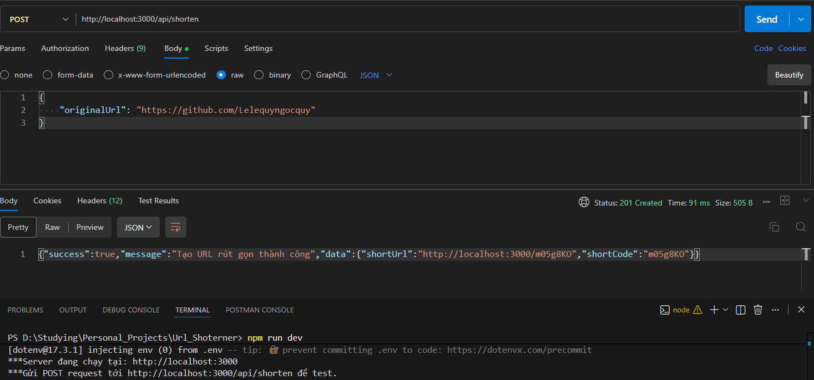
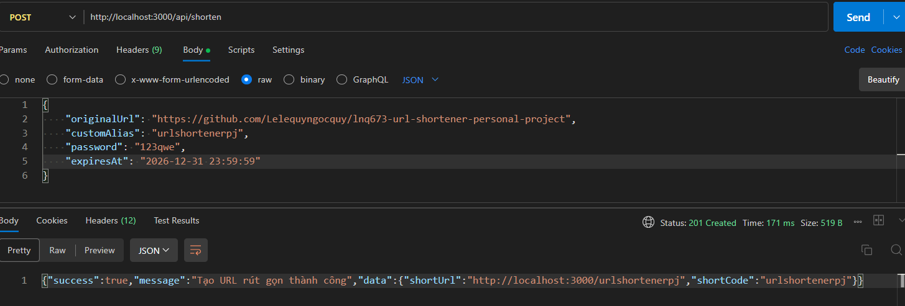
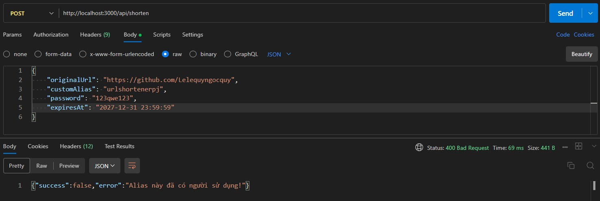

# SwiftLink - A Scalable URL Shortener Backend Service

A modern, robust backend service inspired by Bitly, designed for performance, security, and scalability. Built with Node.js and powered by TiDB Cloud (a distributed SQL database), this project showcases production-ready backend design patterns.

**Repository:** https://github.com/Lelequyngocquy/lnq673-url-shortener-personal-project.git

---

## Key Features

This isn't just a basic URL cloner. It integrates essential production-level features:

- **Core Logic:** Efficiently generates short codes from long URLs and performs fast 302 redirects.
- **Custom Aliases:** Users can choose their own memorable short URLs (e.g., `short.ly/my-portfolio`).
- **Expiration Dates:** Links can automatically expire after a set time to enhance security.
- **Private Links:** Protect sensitive links with password hashing using **bcrypt**.
- **Real-time Analytics:** Tracks clicks, IP addresses, user agents, and referrers without compromising redirect speed (using asynchronous logging design).
- **Rate Limiting:** Protects the API from spam and brute-force attacks (`express-rate-limit`).

---

## Tech Stack

- **Runtime:** Node.js (Express.js)
- **Database:** **TiDB Cloud** (Distributed SQL, MySQL compatible) - Chosen for scalability.
- **Libraries:** `mysql2` (promise-based), `bcryptjs` (security), `dotenv` (config), `nanoid`/`crypto` (unique ID generation).

---

## Installation & Setup

Want to run this project locally? Follow these steps:

### Prerequisites

- Node.js installed.
- A free TiDB Cloud cluster (or any MySQL instance).

### Steps

1.  **Clone the repository:**

    ```bash
    git clone https://github.com/Lelequyngocquy/lnq673-url-shortener-personal-project.git
    cd lnq673-url-shortener-personal-project
    ```

2.  **Install dependencies:**

    ```bash
    npm install
    ```

3.  **Configure Environment Variables:**
    Create a `.env` file in the root directory and add your TiDB connection details (Do NOT commit this file!):

    ```env
    PORT=3000
    DB_HOST=your_tidb_host
    DB_PORT=4000
    DB_USERNAME=your_username
    DB_PASSWORD=your_password
    DB_DATABASE=url_shortener
    DB_USING_SSL=true #delete or set it false if you dont use ssl connection with database
    ```

4.  **Initialize Database Schema:**
    Run this script once to automatically create the required tables in your TiDB cluster:

    ```bash
    node src/config/db-init.js
    ```

5.  **Run the Server:**
    For development mode with auto-reload:
    ```bash
    npm run dev
    ```
    The server will start at `http://localhost:3000`.
6.  **Run the Server WITH DOCKER IMAGE (optional):**

    ```bash
    docker build -t url_shortener .
    docker run -p 3210:3000 --env-file .env url_shortener
    ```

    The server will start at `http://localhost:3210`.

---

## API Endpoints

### 1. Basic URL Shortening

This example shows the simplest use case: creating a short link with an automatically generated unique code.

**Endpoint:** `POST /api/shorten`

**Request Body (JSON):**

```json
{
  "originalUrl": "https://github.com/Lelequyngocquy"
}
```



### 2. Create Short URL WITH PREMIUM OPTION

`POST /api/shorten`

**Body (JSON):**

```json
{
  "originalUrl": "https://example.com/very-long-link",
  "customAlias": "optional-custom-name",
  "password": "optional-password",
  "expiresAt": "2025-12-31 23:59:59"
}
```



